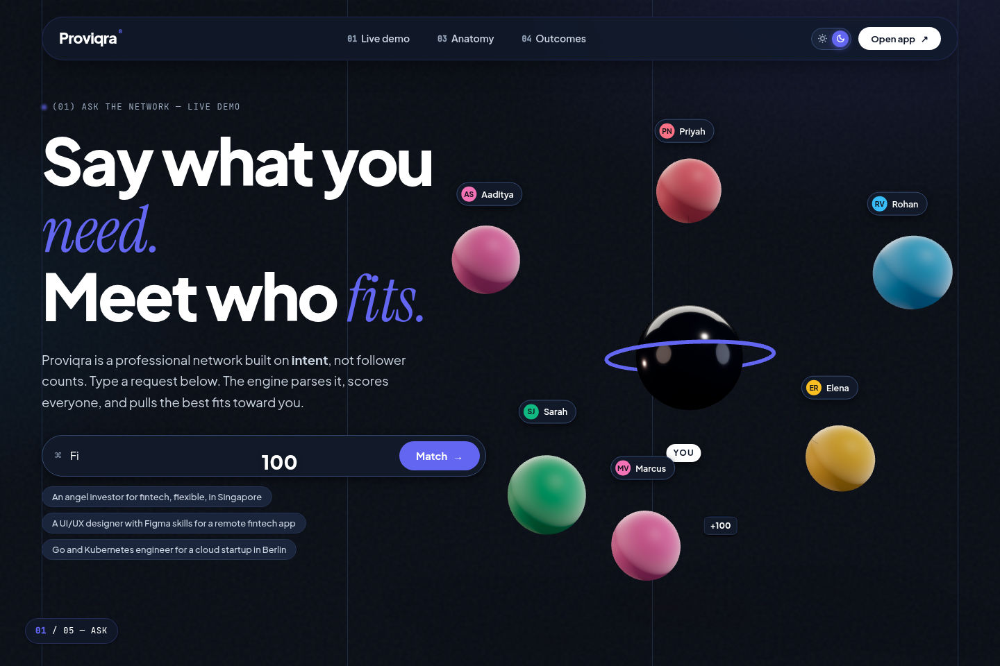
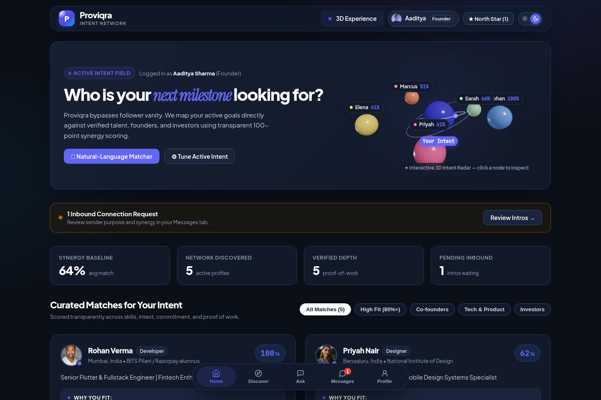
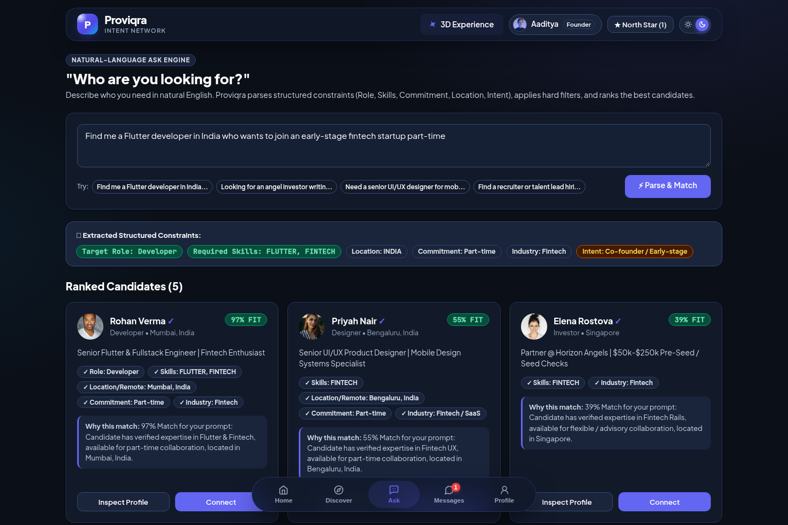
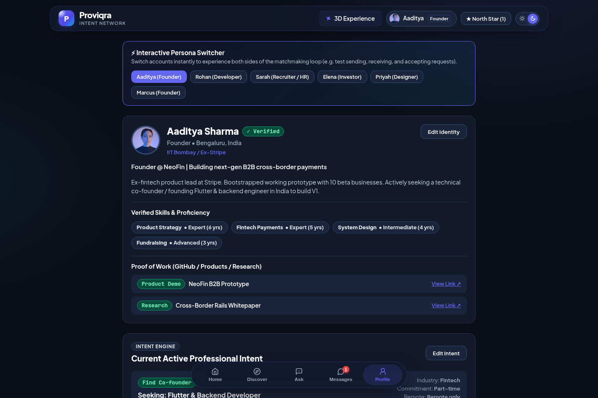
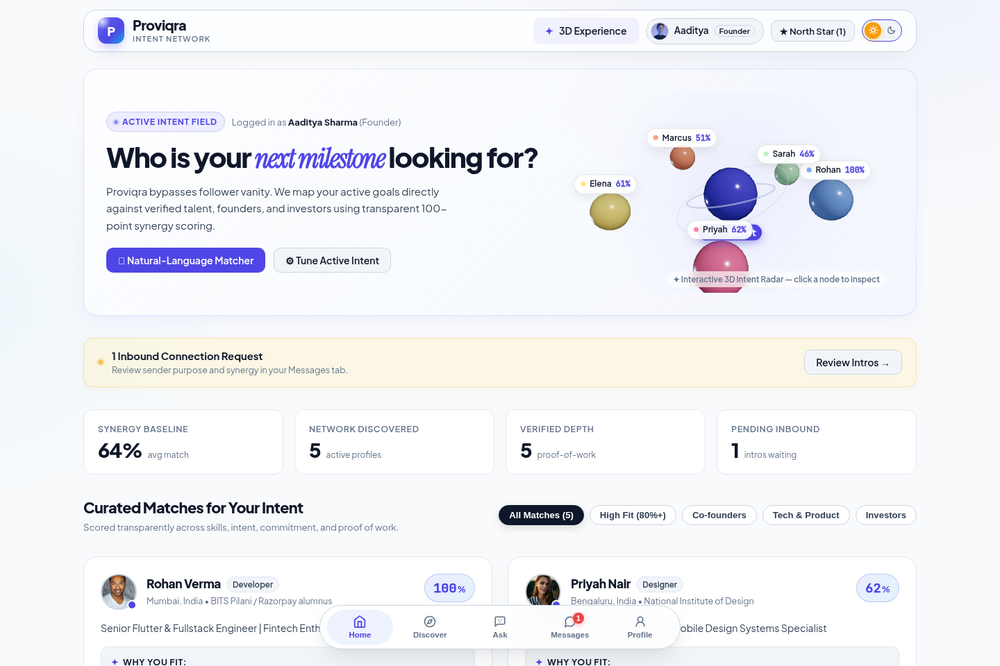

# PROVIQRA

A front-end prototype for a professional opportunity network. PROVIQRA explores matching people through skills, proof-of-work links and professional intent rather than follower counts.

Built with **React 18, JavaScript, CSS and Vite**, with **Three.js, React Three Fiber and Drei** for its 3D scenes.

> **Prototype status:** The app uses seeded sample profiles, opportunities, conversations and browser-local state. Verification badges, professional histories, match scores and dashboard metrics are demo data. It is not a live multi-user service, and the fictional "Aaditya Sharma" profile is not Aaditya Khurana's biography.

## Screenshots

Real screenshots of the repository's committed build, running locally. No mockups or fabricated app screens.

### 3D landing page



### Matching dashboard



### Search by professional intent



### Sample profile



### Light mode



## What the prototype includes

- **Profiles:** roles, skills, proof-of-work links and current professional intent.
- **Matching:** rule-based scoring with compatibility breakdowns, positive reasons and gaps.
- **Ask search:** keyword-based parsing of English queries into role, skills, location, commitment and industry criteria, followed by candidate ranking.
- **Discovery:** sample people and opportunities.
- **Connections:** request, accept and decline flows, with demo conversations after accepting.
- **Messaging and outcomes:** browser-local conversations and outcome logging.
- **Safety controls:** local blocking and reporting flows.
- **Presentation:** a 3D landing page and dashboard radar, light/dark themes and a demo persona switcher.

Matching and search are deterministic JavaScript rules, not an LLM or a deployed AI service. Proof-of-work links and verification labels in the sample dataset do not perform external identity or achievement verification.

## How matching works

The matching engine combines these weights into a score out of 100:

| Factor | Maximum points |
| --- | ---: |
| Skills compatibility | 35 |
| Professional intent | 25 |
| Commitment and availability | 15 |
| Industry | 10 |
| Location and remote fit | 5 |
| Experience | 5 |
| Interests and proof of work | 5 |

These are prototype heuristics, not measured hiring outcomes or accuracy statistics.

## Run the committed build

Install Node.js and npm, then:

```bash
git clone https://github.com/KhuranaCode/PROVIQRA.git
cd PROVIQRA
npm ci
npm run preview -- --host 127.0.0.1
```

Open the local URL Vite prints. Use the landing page's **Open app** button to enter the prototype. State is stored in browser `localStorage`; clearing this site's local storage resets the demo.

### Current source-build limitation

The inspected repository includes `dist/index.html` and compiled assets, but lacks a root `index.html`. The committed build works with `npm run preview`; `npm run dev` returns 404, and a new source build requires the missing HTML entry restored. This README does not claim that the normal development/build workflow is currently complete.

After the root entry is restored, the existing scripts are:

```bash
npm run dev
npm run build
npm run preview
```

## Project structure

```text
src/
  main.jsx                  # Landing/app route switch
  App.jsx                   # Tabs, connections and local demo actions
  landing/                  # Landing UI and 3D scene
  features/
    home/                   # Matching dashboard
    discover/               # People and opportunity discovery
    ask/                    # Query parsing and ranked results UI
    messages/               # Demo conversations
    profile/                # Profile, skills and intent UI
  engines/
    matchingEngine.js       # Rule-based compatibility scoring
    askEngine.js            # Keyword-based query parsing/search
  core/
    storage.js              # Seed data and localStorage persistence
    state.js                # Hydration and connection/block helpers
    theme.js                # Theme persistence
    types.js                # Roles and state constants
  components/               # Cards, modals and notifications
dist/                       # Committed preview build
```

## Checks

The repository includes these Node scripts:

```bash
node test_core.js
node test_engines.js
```

They exercise state hydration, block visibility, connection-state helpers, matching and sample query behavior. They are prototype checks, not evidence of complete security, deployment readiness or real-world performance.

## Limits and next steps

- Add a backend and server-side authentication before real multi-user use.
- Replace seeded profiles and opportunities with authorized real data.
- Implement real verification and moderation processes before presenting badges as verified facts.
- Restore the root HTML entry and verify the source build.
- Add automated assertions and broader tests for edge cases and UI flows.
- Keep secrets and dependency folders out of Git; review staged changes before pushing.

## License

The repository includes an MIT license in `LICENSE`.
